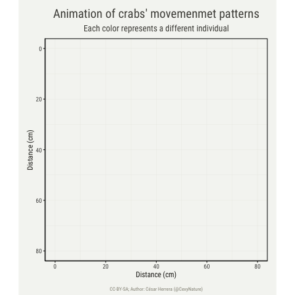

Motion analysis of intertidal crabs
=============

[](https://www.gnu.org/licenses/gpl-3.0)
[](https://twitter.com/cexynature?lang=en)

This repository contains all R scripts required to reproduce the R figures in *Herrera et al (2020) A computer vision approach for studying fossorial and cryptic crabs*.

Data required for running the R scripts in this repository is available in <data-link>.

A list with all R scripts and their description can be found inside the [R directory]()

## Project structure:

```
Project_name/
|--- README.md
|--- crabs_moving.Rproj
|--- LICENSE.md
|--- data/
	|--- README.md
	|--- raw/
        |--- video1_files/
        |--- video2_files/
        |--- ...
	|--- tidy/
        |--- *.csv
        |--- *.Rds
|--- figures/
	|--- README.md
|--- R/
    |--- README.md
    |--- *.R
    |--- ...
|--- src/
	|--- README.md
	|--- img_repo/
		|--- 
		|--- 
```




